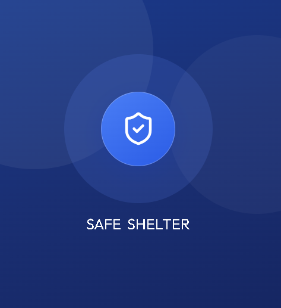

# 🛡️ Safe Shelter

> **A Full-Stack Disaster Shelter Management System**  
> Developed as a Computer Engineering Graduation Project.


---
<p align="center">
  
</p>

## 📌 Project Purpose

Safe Shelter is a full-stack disaster management platform developed to improve emergency response by providing a centralized system for managing shelters, coordinating volunteers, tracking resources, and assisting disaster victims during emergency situations.

The system consists of three integrated applications:

- 🌐 Web Administration Panel
- 📱 Mobile Application
- ⚙️ Laravel REST API Backend

---

## ✨ Key Features

- 🏠 Shelter Management
- 👨‍👩‍👧 Family Card Management
- 📷 QR Code Check-in / Check-out
- 🗺️ Offline Map Support
- 📍 Smart Shelter Navigation
- 📦 Resource Monitoring
- ❤️ Donation Management
- 🚨 Emergency Help Requests
- 🔔 Notifications
- 👥 Volunteer Coordination

---

## 🛠️ Tech Stack

### Backend

- Laravel
- PHP
- MySQL
- Laravel Sanctum
- REST API

### Web

- React
- TypeScript
- Vite
- Tailwind CSS
- Axios

### Mobile

- React Native
- Expo
- React Navigation

---

## 📂 Project Structure

```text
Safe_Shelter
│
├── backend
├── web
├── mobile
└── assets
    └── images
```

---

## 🌐 Web Screenshots

| Login | Dashboard |
|--------|-----------|
|  |  |

| Shelters | Resources |
|----------|-----------|
|  |  |

| Families |
|----------|
|  |

---

## 📱 Mobile Screenshots

| Home | Offline Map |
|------|-------------|
|  |  |

| QR Scanner | Smart Card |
|-----------|------------|
|  |  |

| Navigation |
|------------|
|  |

---

## 🌟 Highlights

- Offline Map Support
- QR-based Shelter Entry & Exit
- Family Card Management
- Resource & Donation Tracking
- Emergency Help Requests
- Smart Shelter Navigation
- Responsive Web Dashboard
- RESTful API Architecture

---

## 🚀 Installation

### Backend

```bash
composer install
cp .env.example .env
php artisan key:generate
php artisan migrate
php artisan serve
```

### Web

```bash
npm install
npm run dev
```

### Mobile

```bash
npm install
npx expo start
```

---

## 👩‍💻 Developer

**Iman Sabouni**

Bachelor of Computer Engineering

Istanbul Arel University

Graduation Project – 2026

---

## 📄 License

This project was developed for educational and demonstration purposes.

---

⭐ If you found this project interesting, feel free to star the repository.